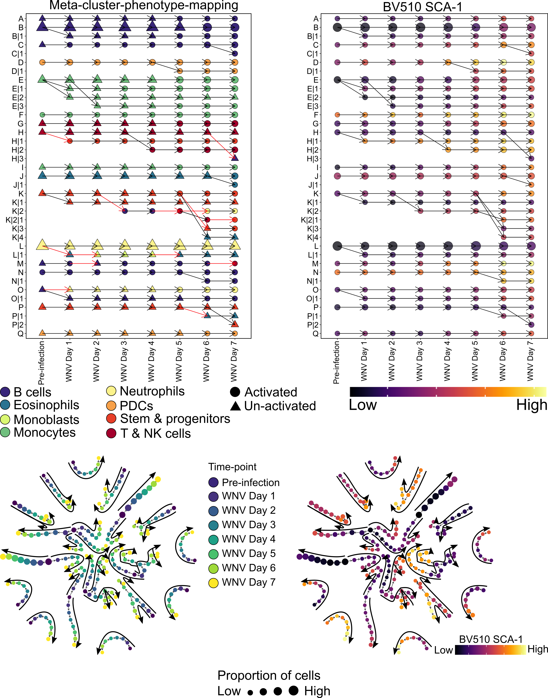

# TrackSOM



TrackSOM is a clustering and temporal cluster tracking algorithm for clustering and tracking cellular populationchanges in time- and disease-course cytometry data.

## Step by step walkthrough
We are in the process of writing up a step by step walkthrough on how to use TrackSOM.
For now, please check out a sample workflow script uploaded in [`inst/sample_workflow`](https://github.com/ghar1821/TrackSOM/blob/master/inst/sample_workflow/TrackSOM_workflow.R) directory.

## Reference
Please cite the following preprint if you find TrackSOM useful in your research.
```
@article {Putri2021.06.08.447468,
	author = {Putri, Givanna Haryono and Chung, Jonathan and Edwards, Davis N and Marsh-Wakefield, Felix and Dervish, Suat and Koprinska, Irena and King, Nicholas JC and Ashhurst, Thomas Myles and Read, Mark Norman},
	title = {TrackSOM: mapping immune response dynamics through sequential clustering of time- and disease-course single-cell cytometry data},
	elocation-id = {2021.06.08.447468},
	year = {2021},
	doi = {10.1101/2021.06.08.447468},
	publisher = {Cold Spring Harbor Laboratory},
	abstract = {Mapping the dynamics of immune cell populations over time or disease-course is key to understanding immunopathogenesis and devising putative interventions. We present TrackSOM, an algorithm which delineates cellular populations and tracks their development over a time- or disease-course of cytometry datasets. We demonstrate TrackSOM-enabled elucidation of the immune response to West Nile Virus infection in mice, uncovering heterogeneous sub-populations of immune cells and relating their functional evolution to disease severity. TrackSOM is easy to use, encompasses few parameters, is quick to execute, and enables an integrative and dynamic overview of the immune system kinetics that underlie disease progression and/or resolution.Competing Interest StatementThe authors have declared no competing interest.},
	URL = {https://www.biorxiv.org/content/early/2021/06/09/2021.06.08.447468},
	eprint = {https://www.biorxiv.org/content/early/2021/06/09/2021.06.08.447468.full.pdf},
	journal = {bioRxiv}
}
```

The preprint titled **TrackSOM: mapping immune response dynamics through sequential clustering of time- and disease-course single-cell cytometry data** can be found on [bioRxiv](https://www.biorxiv.org/content/10.1101/2021.06.08.447468v1).

## Support and contribute
We are continuously working to improve TrackSOM and welcome feedbacks.
If you have questions or have encountered issues using TrackSOM, please post an [`issue ticket`](https://github.com/ghar1821/TrackSOM/issues).

## Publications using TrackSOM
TrackSOM was used to analyse COVID-19 temporal data published in Cell Reports Medicine journal:


> Koutsakos, M., Rowntree, L.C., Hensen, L., Chua, B.Y., van de Sandt, C.E., Habel, J.R., Zhang, W., Jia, X., Kedzierski, L., Ashhurst, T.M. and Putri, G.H., 2021. Integrated immune dynamics define correlates of COVID-19 severity and antibody responses. Cell Reports Medicine, p.100208.

The R scripts used to analyse the COVID-19 data are uploaded into [inst/publications/covid19_paper](https://github.com/ghar1821/TrackSOM/tree/master/inst/publications/covid19_paper) directory.

## License
TrackSOM is released under the GPL-3.0 lincense, included [here](LICENSE).